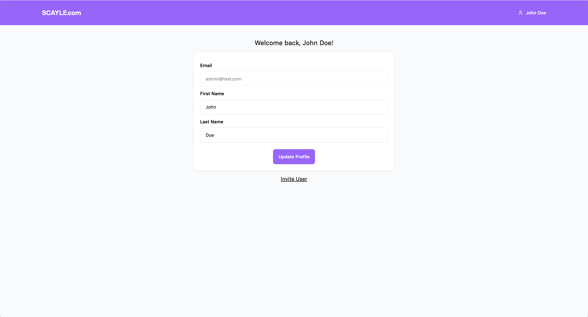
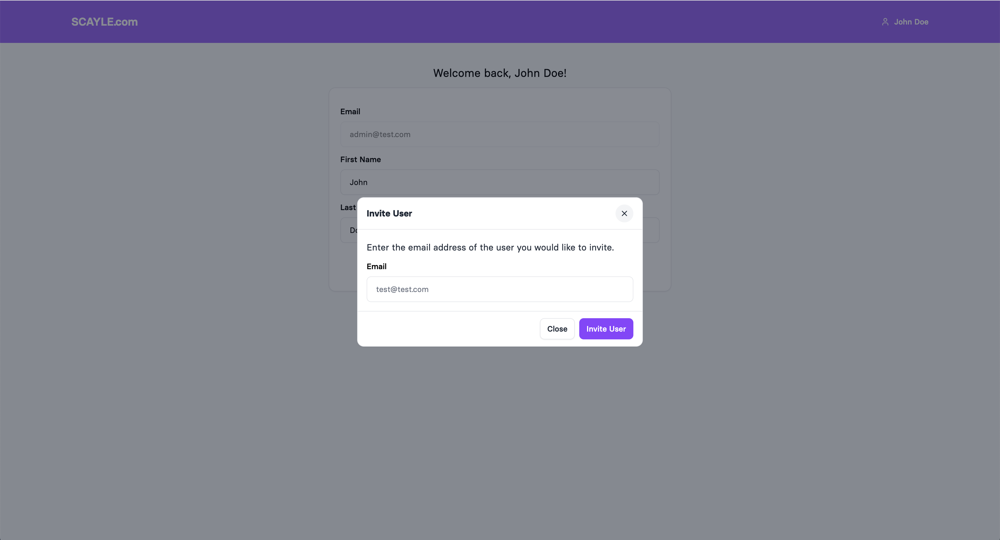

# Django-HTMX Coding Challange

Welcome to the e1+ coding challenge. This repo is a simple web application with a login and a user management page. It contains errors, code smells and it is incomplete.

## How to

- Download the repository, remove the .git folder and upload the repo to your github/gitlab/bitbucket/... account as public repository.
- Create a new branch called "solution"
- Solve the coding challenge in this branch. Feel free to use Google etc. Please do not ask any questions regarding the challenge itself. Please come up with logical assumptions if something is not clear during the challenge.
- Commit and push the changes to your "solution" branch once you are done.
- Open a Merge Request from the "solution" branch to the "main" branch.
- Send us the link to your Merge Request. Please make sure that your repository is public so that we can actually review it.

## General

Follow the tasks below to solve the coding challange. Keep in mind that good code includes tests.

This project uses the follwing libraries which are already set up and ready to use:
- [tailwind css](https://tailwindcss.com/)
- [preline UI](https://preline.co/index.html)
- [htmx](https://htmx.org/docs/)

## Prerequisites
- Python Version >3.12
- Node Version Manager (NVM)

## Setup

Create a virtual environment

```bash
python -m venv .venv
```

Activate the virtual environment

```bash 
source .venv/bin/activate
```

Install all dependencies

```bash
pip install -r requirements.txt

nvm use
npm i
```

Execute migrations

```bash
python manage.py makemigrations

python manage.py migrate
```

Create a superuser

```bash
python manage.py createsuperuser
```

## General commands

Start the server by running

```bash
python manage.py runserver
```

Start the tailwind class generator

```bash
npm run dev
```

Execute tests by running

```bash
python manage.py test
```

## Your tasks

Please solve the following tasks in order to complete the coding challenge.

### 1. Fix the login

Start the server and open the browser at localhost:8000. Try to login with the credentials of the superuser. It will not work.
Find out why the login does not work and fix it.


### 2. Fix & extend the profile update form

Now that you are logged in, you will see the profile update screen. As you will see when trying to update your user, there are two problems:
- The form does not work
- The information on the screen is not properly updated to the new data

Please fix these two issues.


Now have a look at the user model. There is a field which is called ```occupation```. We want the user to be able to update this field as well.
Add the field to the form and make sure everything works as expected.


### 3. Invite User Feature

Now it is time to develop a whole new feature. We want to enable the user to invite other users to the web application.

Your todo:
- Create a modal which opens on click of an ```Ìnvite``` button on the profile page.
- Let the user enter the email and click submit
- Create an invitation model using the ORM where you store all invitations
- After submitting the invite, send an email to the invited user. (Use the normal django console backend for that, which just prints the email content to the terminal. It is already setup in the setttings.)
- Think about a concept on how to finish this feature and discuss it with the interviewer

Out of scope:
- Sending the email
- Building the "Accept Invitation" view and logic


See screenshots for reference:



